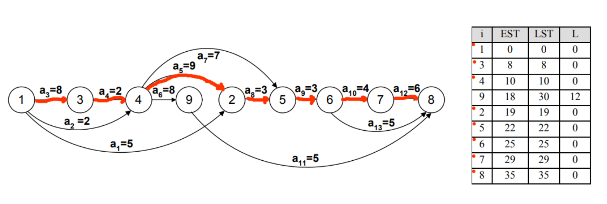

# Critical Path Method (CPM) - Project Management Tool

## Overview

This project implements a Critical Path Method (CPM) tool in C++. It allows users to define tasks with durations, prerequisites, and calculates the earliest start time (EST), latest start time (LST), and slack for each task. The tool also identifies the critical path — the longest sequence of dependent tasks that determines the minimum project duration.



## Features

- **Task Management**: Define tasks with an ID, duration, and their prerequisites.
- **Topological Sort**: The program processes tasks in topological order to calculate EST and LST values.
- **Critical Path Detection**: It identifies tasks on the critical path where EST equals LST, meaning there is no slack.
- **Slack Calculation**: For each task, the tool calculates the slack, i.e., the time a task can be delayed without affecting the overall project duration.
- **Interactive Menu**: The program provides a simple console menu for task management and path analysis.

## File Descriptions

- **graph.cpp**: Implements the core functionality of the graph, including adding tasks, prerequisites, and calculating EST, LST, and the critical path.
- **graph.h**: Header file defining the `Graph` class, its data structures, and methods.
- **main.cpp**: Contains the interactive menu for adding tasks and prerequisites, as well as displaying results.
- **task.h**: Defines the `Task` struct, which stores task-related information such as ID, duration, EST, LST, and prerequisites.
- **graph.png**: Visual representation of a graph with calculated EST and LST properties, highlighting the critical path.

## Key Functions

- **`addTask()`**: Adds a new task with a unique ID and duration.
- **`addPrereq()`**: Adds a prerequisite relationship between tasks.
- **`calculateEst()`**: Computes the earliest start time (EST) for each task based on its prerequisites.
- **`calculateLst()`**: Computes the latest start time (LST) for each task.
- **`printTasks()`**: Prints a list of all tasks with their prerequisites.
- **`printResults()`**: Displays the EST, LST, and slack for each task, as well as the critical path.

## Example Output

```bash
Aktivnost   EST   LST   Dozv. kasnjenje
1           0     0     0
2           5     5     0
3           7     9     2
...
Kriticni put: 1 2 ...
```

## How to Use

1. **Compile the Program**:
   ```bash
   g++ main.cpp graph.cpp -o cpm_tool
   ```
2. **Run the program**:
   ```bash
   ./cpm_tool
   ```
